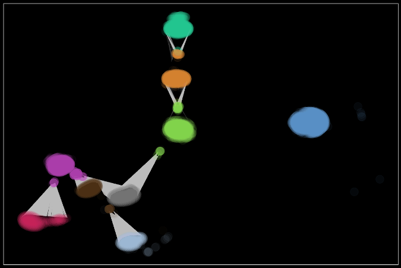

# Clusivity and Sentiment for Political Discourse Analysis

Capstone practicum project for GA Tech OMSA -- a social media discourse analysis.

My teammate (James Roberts) and I applied natural language processing,
functional linguistics, and network analysis to detect stylistic communities of
political speech in a sample of social media posts. Using specific parts of
speech (i.e., pronouns) as psychometric indicators of discourse style, we
extracted linguistic markers for clusivity and affinity to identify agonistic
speech acts, conviction of belief, affiliation, and sentiment.

